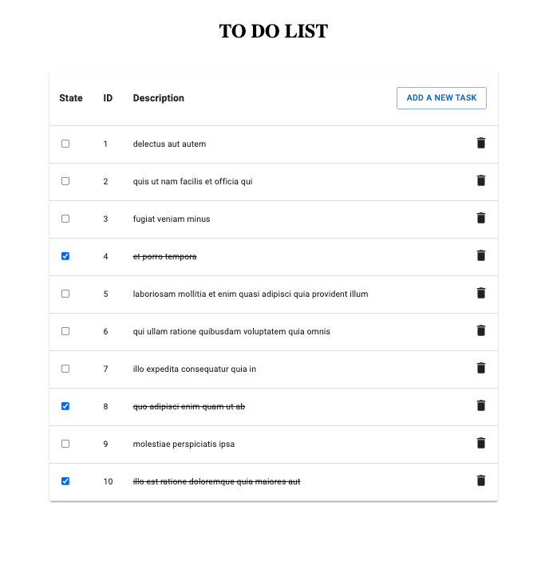

# To Do List Creator

Quick start
 
TO create this project i use an api that returns a json from https://jsonplaceholder.typicode.com/todos/ with 200 tasks by default, with different data.

To call the api i use Axios.

Since it is such a large json I limited it to a maximum of 10 elements to make it easier to understand:

I have created the project to support React, Typescript and Emotion, also using Material UI. With Babel and Webpack

The api interface look like this:

    "userId": number,
    "id": number,
    "title": string,
    "completed": boolean

    I didn't needed the userId so i removed it.

The app look like this:

 

    

   

